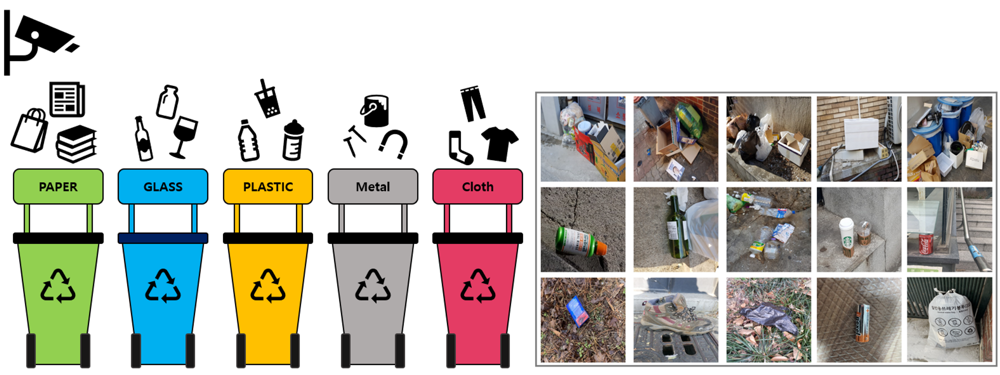
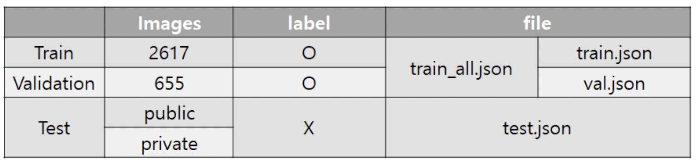
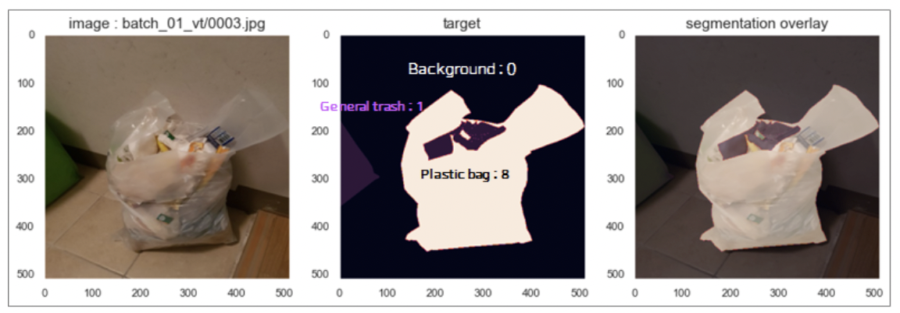
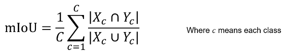
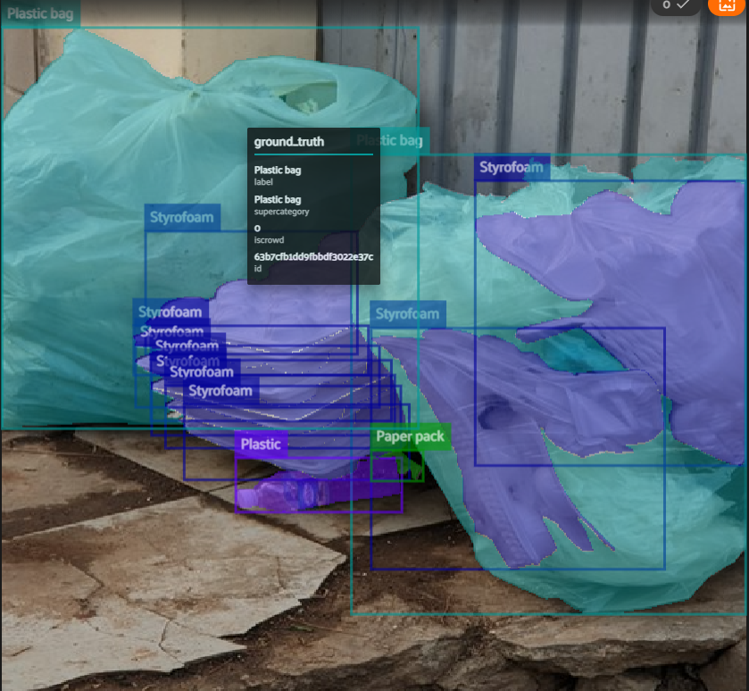
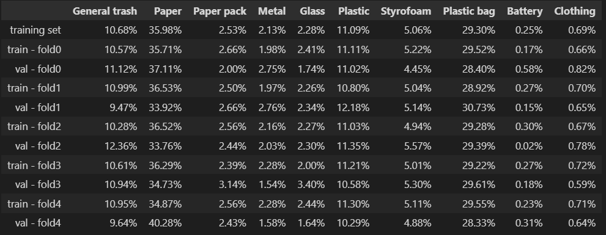
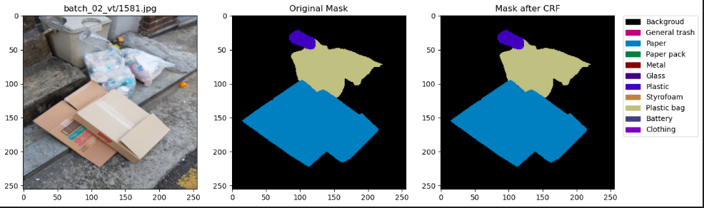
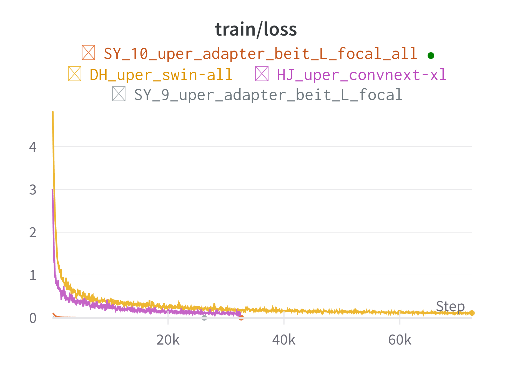
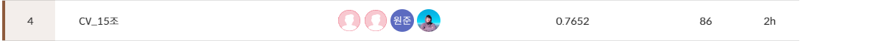

# 📃프로젝트 개요

분리수거는 증가하는 쓰레기양을 줄여 환경 부담을 줄일 수 있는 방법 중 하나입니다. 우리는 사진에서 쓰레기를 Segmentation하는 모델을 만들어 분리수거를 더 쉽게 도와주어 쓰레기 문제를 해결하고자 합니다.

# 💾데이터셋

- 전체 이미지 개수 : 4091장 (Training : 3272장, Test : 819장)
- 11 class : Background, General trash, Paper, Paper pack, Metal, Glass, Plastic, Styrofoam, Plastic bag, Battery, Clothing
- 이미지 크기 : (512, 512)
- Annotation File (COCO format) : 이미지 내 각 픽셀의 클래스 정보

### 평가지표

- Test set의 mIoU(Mean Intersection over Union)로 평가

  

# ✏ 프로젝트 수행 방법

## Data Processing

- MisLabeled - fiftyone을 활용하여 3272 이미지 중에서 잘못 라벨링된 데이터와 비닐봉지 내부 Object를 인식하는 이미지 53개 제거

  

- StratifiedGroupKFold

  

  

- Augmentation

## Modeling

- Model 별 Training
    - [SMP] DeepLabV3Plus + resnet, efficientnet
    - [SMP] PAN + SwinT
    - [SMP] FPN + ViT
    - [mmseg] upernet_swin_L
    - [mmseg] upernet_convnext_xl
    - [mmseg] upernet_adapter_beit_L
- Pesudo Labeling 기법
  - Hard Voting 후 label로 이용
  - CutMix 

- Ensemble 기법
  - Epoch ensemble
  - Weight ensemble
  - Model ensemble

 - Optimizer & Scheduler
   - Adam
   - AdamW
   - ReduceLROnPlateau

- CRF

  

​	→ Dense CRF를 이용해 모든 모델이 0.02~0.03의 성능향상

# 🏆 프로젝트 결과

- Ensemble
  - Vit_19_all_crf : 0.7633
  - Vit_focal_19_crf : 0.7562
  - Vit_focal_27_crf : 0.7439
  - Swin_L_del_all_90_crf : 0.7416
  - Swin_L_del_all_50_crf : 0.7213
  - upernet_convnext_xl_100_crf : 0.7136

- Score
  - Public LB : 0.7712(6등/19팀)
  - Private LB : 0.7652 (4등/19팀)

# 👨‍👨‍👦‍👦 팀원 소개

|         [황순영](https://github.com/soonyoung-hwang)         |            [서원준](https://github.com/won-joon)             |              [이하정](https://github.com/SS-hj)              |             [김도훈](https://github.com/DHKim95)             |
| :----------------------------------------------------------: | :----------------------------------------------------------: | :----------------------------------------------------------: | :----------------------------------------------------------: |
|  |  |  |  |
|                      Modeling, Ensemble                      |                      Modeling, Ensemble                      |              Modeling, Data Split, Augmentation              |              Modeling, Data Split, Augmentation              |
